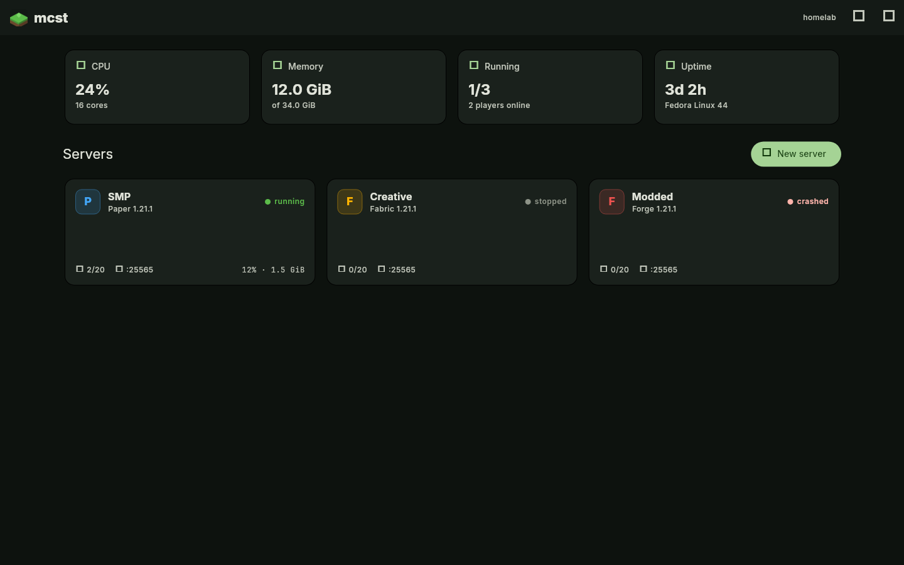
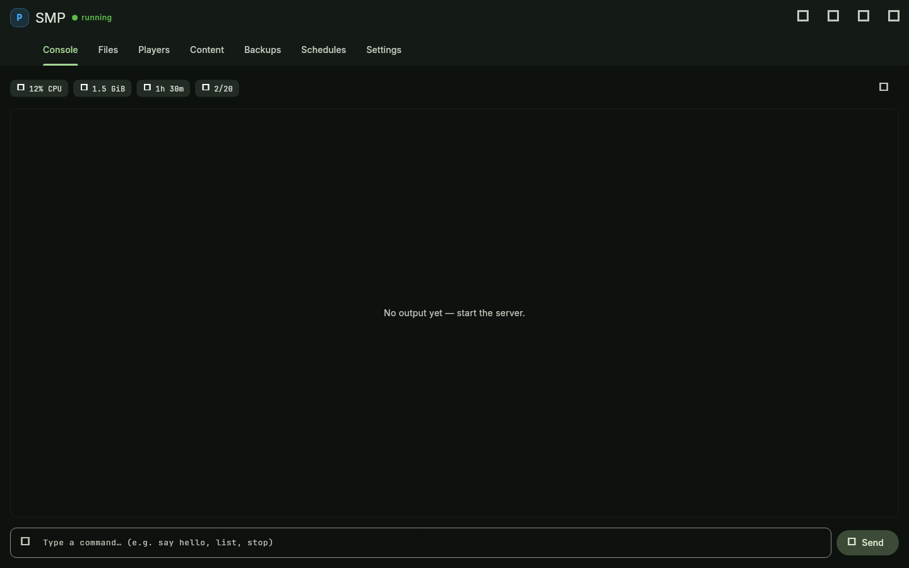
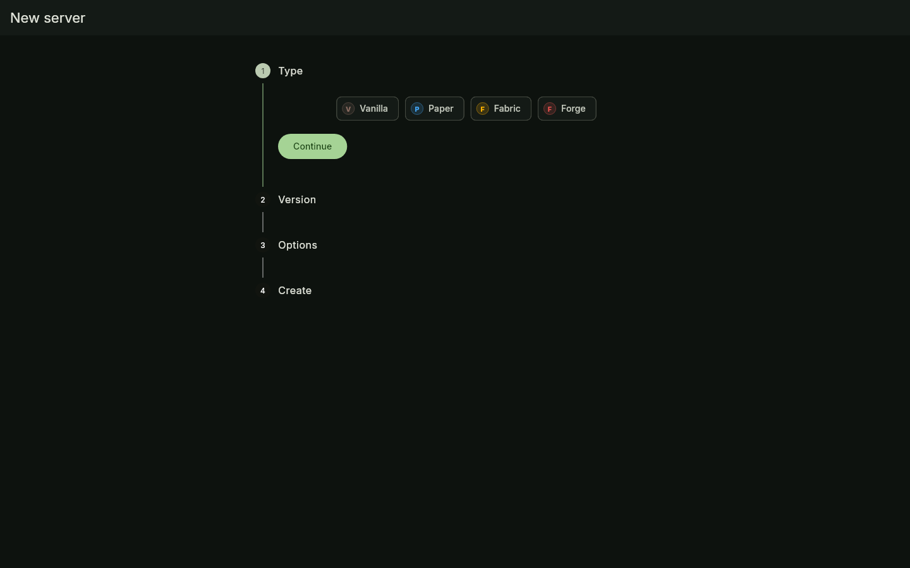
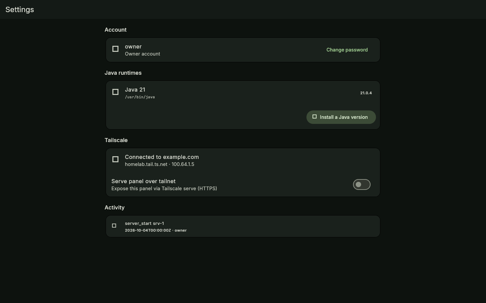

<div align="center">


# mcst — Minecraft Server Tool

**A self-hosted panel for Minecraft servers. One binary, zero config.**

[](https://gitlab.com/HttpAnimations/mcst)
[](https://github.com/justacalico/mcst)
[](LICENSE)
[]()

</div>

mcst runs a web panel from a single native binary — the Flutter UI is compiled
in, the database is a SQLite file, and there are **no `.env` files or required
environment variables**. Run it, open the page, create your account, and start
building servers.



## Features

- **Dashboard** — host CPU / memory / disk / load, running server count and
  live status for every server.
- **Server types** — Paper, Fabric, Forge, NeoForge and Vanilla, with the
  correct loader/Installer flow for each and automatic Java version selection
  (managed runtimes via Adoptium, or your own `java`).
- **Live console** — real-time logs over WebSocket, command input with
  history, player join/leave tracking.
- **Per-server metrics** — CPU, RSS memory, uptime and player counts from the
  process table plus server-list pings.
- **server.properties editor** — both a typed form and a raw text editor that
  preserves comments and ordering.
- **File manager** — browse, edit, upload, download, rename, delete —
  path-traversal safe, rooted inside the server directory.
- **Backups** — zipped world/config backups with notes, one-click restore,
  pruning.
- **Schedules** — every-N-minutes or daily-at-HH:MM timers for restart, start,
  stop, backup or arbitrary console commands.
- **Player management** — ops / whitelist / bans from the UI or via RCON.
- **Modrinth browser** — search and install mods/plugins/datapacks into each
  server without touching SFTP.
- **Crash handling** — auto-restart with backoff, stop timeouts with
  escalate-to-kill, empty-server auto-stop.
- **Tailscale** — serve the panel over `tailscale serve` and share individual
  servers on your tailnet — friends join with no port forwarding.
- **Audit log** — every mutating API call recorded with actor + timestamp.
- **First-run setup** — owner account created in the browser; Argon2id
  password hashing, cookie sessions.

## Quick start

Download a binary from the
[releases](https://github.com/justacalico/mcst/releases) page, then:

```bash
./mcst            # http://localhost:25580
./mcst -p 8080    # custom port
./mcst -d /var/lib/mcst   # custom data directory
```

First launch asks you to create the owner account — that's the entire setup.

### Docker

```bash
docker compose up -d
# or:
docker run -d --name mcst -p 127.0.0.1:25580:25580 \
  -v mcst-data:/home/mcst/data mcst
```

The image ships a JRE so servers run out of the box. Publish each server's
game port alongside the panel port (e.g. `-p 25565:25565`), or use the
Tailscale integration instead.

## CLI

```
mcst [OPTIONS]
  -p, --port <PORT>   Port for the web panel [default: 25580]
      --host <HOST>   Interface to bind [default: 0.0.0.0]
  -d, --data <DIR>    Data directory [default: platform data dir]
      --dev           Dev mode: random port, in-memory DB, no auth
      --local         Dev mode on loopback only
```

Data lives in one directory: `mcst.db`, `servers/`, `backups/`, `java/` —
delete the directory to reset completely.

## Screenshots

| Console | Create wizard | Settings |
|---|---|---|
|  |  |  |

## Development

Rust (axum, sqlx, tokio) backend + Flutter frontend embedded at compile time.

```bash
# backend
cargo test

# frontend (rebuild the embedded bundle)
bash scripts/build-flutter.sh

# frontend tests + coverage gate
cd flutter && flutter test
MIN_COVERAGE=85 bash scripts/check-coverage.sh

# run in dev mode (random port, no auth, in-memory DB, loopback only)
cargo run -- --dev --local
```

Source of truth is [GitLab](https://gitlab.com/HttpAnimations/mcst); GitHub
hosts the mirror and release builds. Landing page lives in `landing/`.

## License

[AGPL-3.0](LICENSE)
